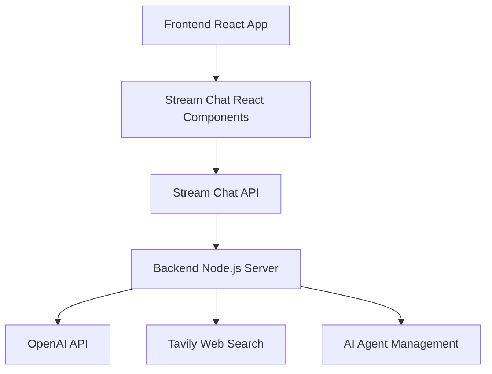

Chat AI App
A modern AI-powered chat application built with Stream Chat, OpenAI, and web search capabilities. This full-stack application provides an intelligent writing assistant that can help with content creation, research, and real-time collaboration.

🚀 Features
Real-time Chat: Powered by GetStream.io for seamless messaging
AI Writing Assistant: OpenAI GPT-4 integration for intelligent content generation
Web Search: Live web search capabilities using Tavily API for current information
Modern UI: Beautiful React interface with dark/light theme support
Writing Prompts: Categorized writing prompts for business, content, communication, and creative tasks
Agent Management: Dynamic AI agent lifecycle management
Secure Authentication: JWT-based token authentication
Responsive Design: Mobile-first design with Tailwind CSS
🏗️ Architecture
Backend (nodejs-ai-assistant/)
Node.js/Express server
Stream Chat server-side integration
OpenAI API for AI responses
Tavily API for web search functionality
Agent management system with automatic cleanup
Frontend (react-stream-ai-assistant/)
React with TypeScript
Stream Chat React components
Tailwind CSS + shadcn/ui for modern styling
Vite for fast development and building
📋 Prerequisites
Node.js 20 or higher
npm or yarn package manager
GetStream.io account (free tier available)
OpenAI API account
Tavily API account (for web search)
**Key Systems:**
AI Agent Management
Dynamic Agent Creation: AI agents are created per chat channel on-demand.

Agent Caching: In-memory cache prevents duplicate agents for the same channel.

Automatic Cleanup: 8-hour inactivity threshold with periodic cleanup.

Race Condition Prevention: Pending agent tracking to prevent duplicate creation.

Web Search Integration
Tavily API: Advanced web search with multiple result sources.

Automatic Search: Triggers web search for current information requests.

Result Synthesis: Combines multiple sources for comprehensive answers.

### Integration Flow

## 📚 Technologies Used

### Backend

- **Node.js** - Runtime environment
- **Express** - Web framework
- **Stream Chat** - Real-time messaging
- **OpenAI** - AI language model
- **Axios** - HTTP client
- **CORS** - Cross-origin resource sharing
- **TypeScript** - Type safety

### Frontend

- **React** - UI library
- **TypeScript** - Type safety
- **Vite** - Build tool
- **Stream Chat React** - Chat UI components
- **Tailwind CSS** - Styling
- **Radix UI** - Accessible components
- **React Hook Form** - Form handling
- **React Router** - Navigation

  
  
  
  

  

